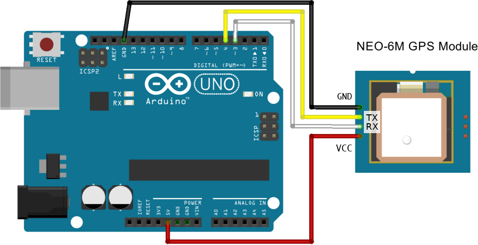

# POC for GPS module NEO-6M

This POC is intended to test capabilities of the GPS module [NEO-6M](https://www.u-blox.com/sites/default/files/products/documents/NEO-6_DataSheet_(GPS.G6-HW-09005).pdf), responsible to get current location coordinates.

## Running

This sample code was ran using [Arduino 1.8.7](https://www.arduino.cc/download_handler.php?f=/arduino-1.8.7-linux64.tar.xz).

Libraries to be referenced:

- `SoftwareSerial` to connect to the serial port and print output
- [`TinyGPSPlus`](https://github.com/mikalhart/TinyGPSPlus/releases)
 to parse [NMEA](https://en.wikipedia.org/wiki/NMEA_0183) string generated by the GPS module

## Circuit Schema

This is the circuit Schema using Arduino UNO.

